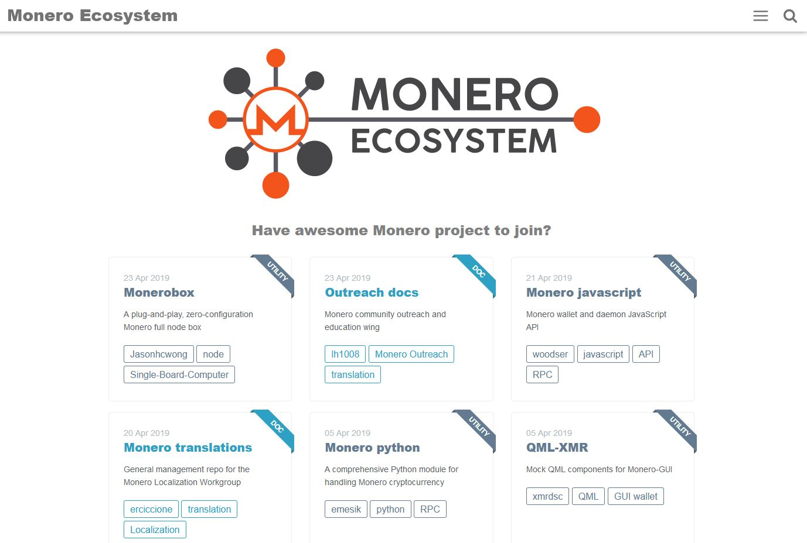

<p align="center"> 


## Why do we need a page for Monero Ecosystem?

This repo keep the files for GitHub Page of [Monero Ecosystem](https://monero-ecosystem.github.io/). All the project belong to the Monero Ecosystem could add a project post on the page. There'll be well organized with tags and categories. This page could make people more easier to explore the Monero Ecosystem. Also raise the visibility of these awesome repositories to the world.

## How do I create a project post for my repo?

That's easy! As long as your repo is one of the Monero Ecosystem project, feel free to fork repo and put your formatted markdown file in the [\_posts folder](https://github.com/monero-ecosystem/monero-ecosystem.github.io/tree/master/_posts). If everything works as you expected, push a pull request. Then your post will show up on the page after merge.

## What's the formatted markdown file?

You can follow the format below, or check out [existing files as examples](https://github.com/monero-ecosystem/monero-ecosystem.github.io/tree/master/_posts).

```
---
layout: post
title: "Meta"
repo_name: 'Meta'
description: 'General management of the Monero Ecosystem project'
introduction: 'General management of the Monero Ecosystem project'
date: 2018-04-10 00:00:00
maintainer: 'erciccione'
maintainer_uid: '28106476'
main-class: 'misc'
image: 'https://github.com/monero-ecosystem/monero-ecosystem.github.io/blob/master/assets/img/blog-image.png'
tags:
- erciccione
- meta
---

## Then your markdown content start here

[what's markdown?](https://guides.github.com/features/mastering-markdown/)


```
**Note:**
- File name is combined with project created date and name: `YYYY-MM-DD-repo-name.md`
- `repo_name` needs accurate name, the same as it in the url.
- `description` shows in the post.
- `introduction` shows on the card.
- `date` should be updated in every editing. It will push active project up on the page.
- `maintainer` needs accurate name, the same as it in the url.
- You can find your `maintainer_uid` [here](https://caius.github.io/github_id/). This is for showing you avatars in the post.
- All the avaliable `main-class` are in the [category](https://github.com/monero-ecosystem/monero-ecosystem.github.io/tree/master/category)
- `image` needs a absolute link. e.g., your repo's raw image url or other image host url.
- Use maintainer's name as first tag in `tags`. Please check [tags list](https://monero-ecosystem.github.io/tags/) first. Follow existing tag if suitable.

## Testing your changes locally
